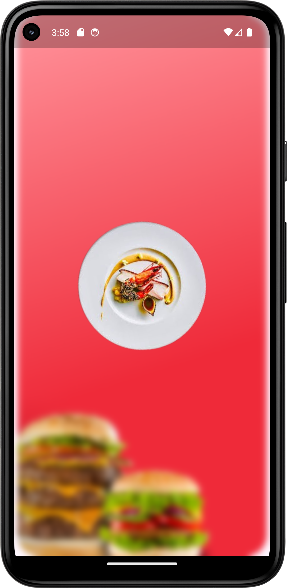
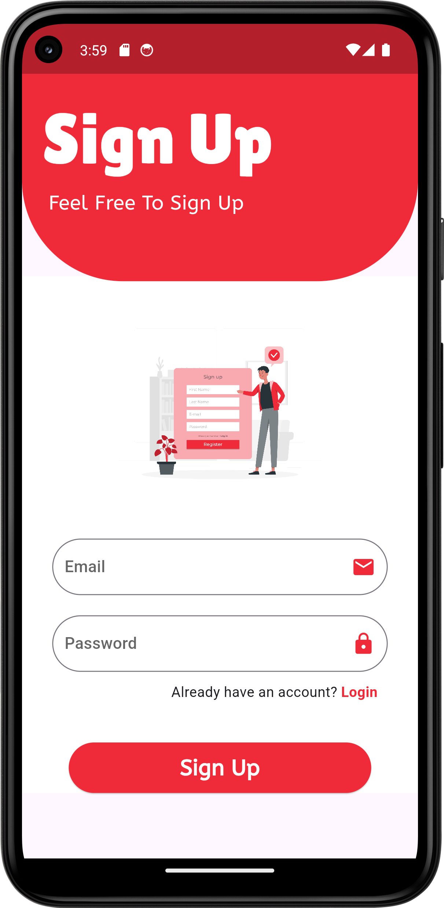
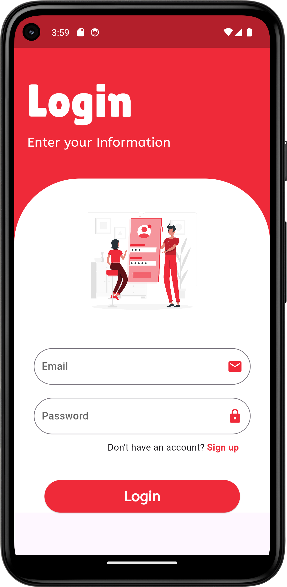
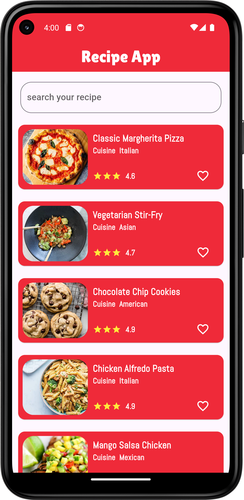
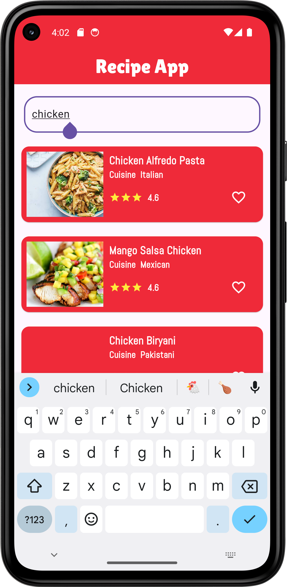
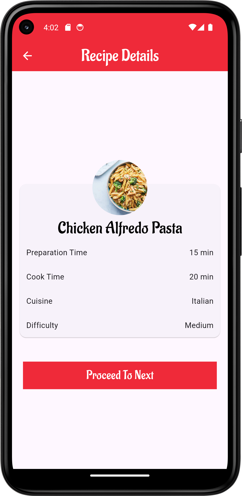

# Flutter Recipe App
As a Flutter developer, I have created a dynamic and user-friendly recipe suggestion app that utilizes API integration to provide users with a diverse array of recipes tailored to their preferences. The app is designed to enhance the culinary experience by offering personalized recipe recommendations based on user input. By leveraging the power of APIs, the app fetches real-time data, ensuring that users have access to the latest and most relevant recipes. The interface is sleek and intuitive, making navigation seamless for users of all ages. Upon entering their dietary preferences, ingredient availability, or desired cuisine, users receive a curated list of recipe suggestions complete with detailed instructions, ingredient lists, and nutritional information. The app is built with Flutter, ensuring cross-platform compatibility and a consistent user experience across both iOS and Android devices. Robust error handling and data validation mechanisms are in place to provide a reliable and smooth user experience. This project showcases the effective use of modern mobile development frameworks and API integration to deliver a high-quality, scalable, and interactive application that meets the culinary needs of its users.

📫 Let's connect! Feel free to reach out to me via email at noormustafa4556@gmail.com or connect with me on LinkedIn to discuss potential collaborations or just chat about all things Flutter!
<h2 align="center">📱 App Screenshots</h2>

  
  
  
  
  
  

 ---
# 👋 Hi, I'm Noor Mustafa

A passionate and results-driven **Flutter Developer** from **Bahawalpur, Pakistan**, specializing in building elegant, scalable, and high-performance cross-platform mobile applications using **Flutter** and **Dart**.

With a strong understanding of **UI/UX principles**, **state management**, and **API integration**, I aim to deliver apps that are not only functional but also user-centric and visually compelling. My development approach emphasizes clean code, reusability, and performance.

---

## 🚀 What I Do

- 🧑‍💻 **Flutter App Development** – I build cross-platform apps for Android, iOS, and the web using Flutter.
- 🔗 **API Integration** – I connect apps to powerful RESTful APIs and third-party services.
- 🎨 **UI/UX Design** – I craft responsive and animated interfaces that elevate the user experience.
- 🔐 **Authentication & Firebase** – I implement secure login systems and integrate Firebase services.
- ⚙️ **State Management** – I use Provider, setState, and Riverpod (in-progress) for scalable app architecture.
- 🧠 **Clean Architecture** – I follow MVVM and MVC patterns for maintainable code.

---

## 🌟 Projects I'm Proud Of

- 🌤️ **[Live Weather Check App](https://github.com/NoorMustafa4556/Live-Weather-Check-App)** – Real-time weather forecast using OpenWeatherMap API  
- 🤖 **[AI Chatbot (Gemini)](https://github.com/NoorMustafa4556/Ai-ChatBot)** – Conversational AI chatbot powered by Google’s Gemini  

- 🍔 **[Recipe App](https://github.com/NoorMustafa4556/Recipe-App)** – Discover recipes with images, categories, and step-by-step instructions  

- 📚 **[Palindrome Checker](https://github.com/NoorMustafa4556/Palindrome-Checker-App)** – A Theory of Automata-based project to identify palindromic strings  

> 🎯 Check out all my repositories on [github.com/NoorMustafa4556](https://github.com/NoorMustafa4556?tab=repositories)

---

## 🛠️ Tech Stack & Tools

| Area                | Tools/Technologies |
|---------------------|--------------------|
| **Languages**       | Dart, JavaScript, Python (basic) |
| **Mobile Framework**| Flutter            |
| **Backend/Cloud**   | Firebase (Auth, Realtime DB, Storage), Django, Flask |
| **Frontend (Web)**  | React.js (basic), HTML, CSS, Bootstrap |
| **State Management**| Provider, setState, Riverpod (learning) |
| **API & Storage**   | REST APIs, HTTP, Shared Preferences, SQLite |
| **Design**          | Material, Cupertino, Lottie Animations, Gradient UI |
| **Version Control** | Git, GitHub        |
| **Tools**           | Android Studio, VS Code, Postman, Figma (basic) |

---

## 🧰 Tech Toolbox

  
  
  
  
  
  
  
  

---

## 📈 Current Focus

- 💡 Enhancing Flutter animations and transitions
- 🤖 Implementing AI-based logic with Google Gemini API
- 📲 Building portfolio-level applications using full-stack Django & Flutter

---

## 📫 Let's Connect!

  
  
  
  
  
  

- 📍 **Location:** Bahawalpur, Punjab, Pakistan

---

> _“Learning never stops. Every app I build makes me a better developer — one widget at a time.”_

---

---

Thank you for visiting! Let’s build something amazing together with Flutter! 🌟 

